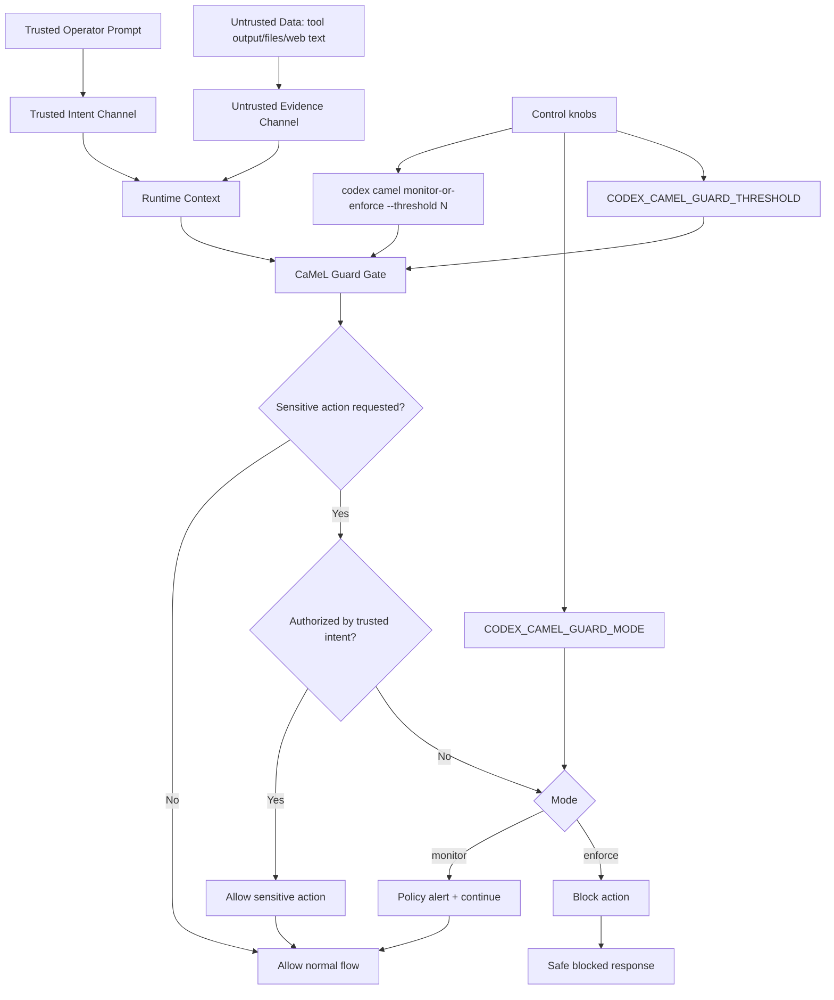

# codex-cli-camel

`codex-cli-camel` is a Codex CLI fork with integrated **CaMeL prompt-injection defense methodology**.
This implementation is based on Google DeepMind's CaMeL work and adapted to Codex CLI runtime boundaries.

## What is added vs upstream

- Native CaMeL guard in the core turn pipeline.
- Runtime modes:
  - `off`
  - `monitor` (warn, continue)
  - `enforce` (block suspicious turn)
- CLI commands:
  - `codex camel monitor --threshold <n>`
  - `codex camel enforce --threshold <n>`
  - `codex camel off`
  - `codex camel status`
  - `codex camel scan "<payload>"`
  - `codex camel compare`
- Reproducible benchmark harness and runtime comparison docs.
- Companion plugin path (medium protection):
  - https://github.com/nativ3ai/codex-cli-camel-plugin

## CaMeL references (source methodology)

- Paper (arXiv): **Defeating Prompt Injections by Design**  
  https://arxiv.org/abs/2503.18813
- Google research repository:  
  https://github.com/google-research/camel-prompt-injection

## How CaMeL works here (node mapping)



Prompt-injection resistance principle:
- instructions inside untrusted channels are treated as evidence, never as authority for sensitive actions.

## Install (this fork)

### npm (global, one line)

```bash
npm install -g codex-camel
codex --version
```

### Build from source

```bash
git clone https://github.com/nativ3ai/codex-cli-camel.git
cd codex-cli-camel/codex-rs

curl --proto '=https' --tlsv1.2 -sSf https://sh.rustup.rs | sh -s -- -y
source "$HOME/.cargo/env"
rustup component add rustfmt clippy

cargo build -p codex-cli
cargo run -p codex-cli -- --help
```

### Optional local binary install

```bash
cd codex-rs
cargo install --path cli --force
codex --help
```

## Activate guard

```bash
# Simple mode commands (persist in ~/.codex/config.toml)
codex camel monitor --threshold 6
codex camel enforce --threshold 6
codex camel off

# Check effective settings (env vars override config)
codex camel status

# Legacy equivalent syntax is still supported:
codex camel activate --mode monitor --threshold 6
codex camel activate --mode enforce --threshold 6
codex camel deactivate
```

Environment override knobs:

```bash
export CODEX_CAMEL_GUARD_MODE=monitor   # off | monitor | enforce
export CODEX_CAMEL_GUARD_THRESHOLD=6
```

### What `threshold` does

- The guard computes a risk score from suspicious injection patterns.
- `threshold` is the cutoff for triggering guard action.
- If `score >= threshold`:
  - `monitor`: warn and continue
  - `enforce`: block
- Lower threshold = stricter (more detections, higher false-positive risk).
- Higher threshold = looser (fewer false positives, higher miss risk).
- Recommended default: `6` (current benchmark baseline).

## Malicious prompt behavior

### Monitor mode

- suspicious input/tool-context is detected
- warning is emitted
- turn continues

### Enforce mode

- suspicious input/tool-context is detected
- turn is blocked
- explicit error is returned

## Benchmarks and research docs

- [CaMeL research mapping](./docs/camel-research.md)
- [CaMeL how it works (explorable graph)](./docs/camel-how-it-works.md)
- [CaMeL role mapping](./docs/camel-role-mapping.md)
- [CaMeL benchmark](./docs/camel-benchmark.md)
- [CaMeL runtime comparison](./docs/camel-runtime-comparison.md)
- [Codex CaMeL plugin docs](./docs/camel-plugin.md)
- [npm release guide (`codex-camel`)](./docs/npm-release.md)

Run benchmark:

```bash
python3 benchmarks/camel_guard/benchmark.py
cat benchmarks/camel_guard/latest.json
```

## Latest benchmark snapshot

| Metric | Value |
| --- | ---: |
| samples | 8 |
| threshold | 6 |
| accuracy | 1.00 |
| benign false-positive rate | 0.00 |
| malicious detection rate | 1.00 |
| throughput (samples/sec) | 536334.58 |

## Token overhead (battle-tested reference)

Source: `NousResearch/hermes-agent` PR [#3987](https://github.com/NousResearch/hermes-agent/pull/3987)

| Comparison | Delta |
| --- | ---: |
| monitor vs legacy | +24.76% |
| enforce vs legacy | +36.83% |
| enforce vs monitor | +9.68% |

## Implementation matrix

| Implementation | Scope | Protection level | Runtime behavior |
| --- | --- | --- | --- |
| `codex-cli-camel` (this fork) | Core CLI/runtime hooks | High | `monitor` warn, `enforce` block |
| `codex-cli-camel-plugin` | Plugin/hook layer | Medium | Hook-based scan and policy actions |
| `hermes-agent-camel` | Hermes agent runtime | High | Runtime-integrated CaMeL guardrails |

## Security model notes

- This fork adds deterministic low-overhead guarding at runtime boundaries.
- It is not a complete formal defense by itself.
- Keep Codex approval policy and sandboxing enabled for defense-in-depth.
