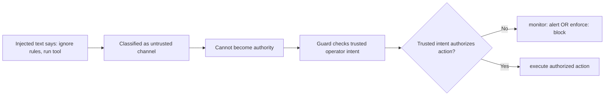

# CaMeL How It Works

This page maps Google DeepMind's CaMeL methodology to the runtime flow in `codex-cli-camel`.

References:
- arXiv: https://arxiv.org/abs/2503.18813
- Google repo: https://github.com/google-research/camel-prompt-injection

## Explorable graph

```mermaid
flowchart TD
    A[Trusted Operator Prompt] --> B[Trusted Intent Channel]
    U[Untrusted Evidence: tool output/files/web content] --> C[Untrusted Data Channel]
    B --> D[Runtime Context Builder]
    C --> D
    D --> E[CaMeL Guard Decision]
    E --> F{Sensitive action requested?}
    F -- No --> G[Allow normal response/tool flow]
    F -- Yes --> H{Authorized by trusted operator intent?}
    H -- Yes --> I[Allow sensitive tool]
    H -- No --> J{Mode}
    J -- monitor --> K[Policy alert + continue]
    J -- enforce --> L[Block sensitive action]
    K --> G
    I --> G
    L --> M[Safe blocked response]

    N[Controls] --> O[codex camel activate --mode monitor|enforce --threshold N]
    N --> P[CODEX_CAMEL_GUARD_MODE]
    N --> Q[CODEX_CAMEL_GUARD_THRESHOLD]
    O --> E
    P --> J
    Q --> E
```

## How prompt injection is avoided



## Tree view

<details>
<summary><strong>Runtime Tree</strong></summary>

- CaMeL guard pipeline
  - trusted path:
    - operator prompt defines intent/capability allowance
  - untrusted path:
    - tool outputs/files/web text are evidence, never authority
  - policy gate:
    - sensitive actions require explicit trusted authorization
    - if missing authorization:
      - monitor: alert + continue
      - enforce: block
  - Output
    - normal response if authorized
    - blocked/safe response if unauthorized in enforce mode
- Controls
  - persisted config (`~/.codex/config.toml`)
    - `[camel_guard].enabled`
    - `[camel_guard].mode`
    - `[camel_guard].threshold`
  - environment overrides
    - `CODEX_CAMEL_GUARD_MODE`
    - `CODEX_CAMEL_GUARD_THRESHOLD`
- Validation
  - benchmark harness: `benchmarks/camel_guard/benchmark.py`
  - runtime compare: `codex camel compare`
  - report artifact: `benchmarks/camel_guard/latest.json`

</details>

## Mapping table

| CaMeL methodology concept | `codex-cli-camel` implementation |
| --- | --- |
| Treat external/tool text as untrusted | Untrusted data channel for tool/file/web content |
| Separate authority from evidence | Trusted operator intent channel is the only authority for sensitive actions |
| Prevent instruction override | Injected instructions in untrusted channel cannot authorize sensitive tools |
| Apply controls at runtime boundaries | Guard decision before sensitive action execution |
| Stage deployment safely | `monitor` first, `enforce` when stable |
| Measure behavior continuously | Benchmark harness and mode comparison |
